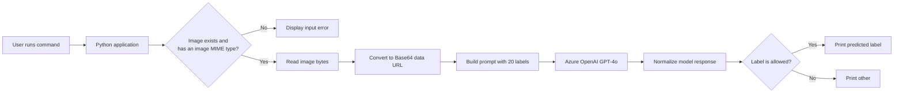

# Use Case 1: Multimodal Image Classification

This lab uses an Azure OpenAI `gpt-4o` deployment to classify a local image
into one of 20 predefined categories. If no category matches, the application
returns `other`. The predicted label is printed directly in the terminal.

## Objective

- Read an image supplied at runtime.
- Convert the image into a Base64 data URL.
- Send the image and classification instructions to Azure OpenAI.
- Accept only an approved category or `other`.
- Display the result in the terminal.

## Architecture



## Project structure

```text
Use Case 1 - Multimodal Image Classification/
|-- image_classifier.py
|-- requirements.txt
|-- README.md
`-- images/
    `-- sample.png
```

The local `.venv` directory and Python cache files are development artifacts
and must not be committed to GitHub.

## How the code works

### 1. Imports

`base64` converts the binary image into text that can be included in an API
request. `guess_type` detects the image MIME type. `os` and `sys` validate the
command-line input, while `re` cleans the model's answer. `OpenAI` provides the
Python API client.

### 2. Azure OpenAI configuration

The following constants identify the Azure OpenAI resource and deployment:

```python
AZURE_OPENAI_ENDPOINT = "https://YOUR-RESOURCE.openai.azure.com/openai/v1"
AZURE_OPENAI_KEY = "YOUR_AZURE_OPENAI_KEY"
AZURE_OPENAI_DEPLOYMENT = "gpt-4o"
```

Replace the endpoint and key placeholders with your Azure values before
running the lab. Never commit a real API key to a public repository.

### 3. Category list

`LABELS` contains the 20 valid categories. The prompt instructs the model to
select exactly one of these categories. Images that do not match are assigned
to `other`.

### 4. API client

`OpenAI(base_url=..., api_key=...)` connects the OpenAI Python SDK to the Azure
OpenAI v1 endpoint. API requests use the `gpt-4o` deployment name as the model.

### 5. `image_to_data_url()`

This function:

1. Detects the file's MIME type, such as `image/png` or `image/jpeg`.
2. Rejects a file that is not recognized as an image.
3. Reads the image in binary mode.
4. Base64-encodes the bytes.
5. Returns a data URL such as `data:image/png;base64,...`.

### 6. `classify_image()`

This function converts the image, joins the allowed labels into the prompt,
and sends a multimodal Chat Completions request. The user message contains both
text instructions and the Base64 image. `detail: auto` lets the model select
the appropriate image processing detail.

The returned text is normalized to lowercase and stripped of unexpected
punctuation. The final validation prevents any value outside `LABELS`; an
unexpected answer becomes `other`.

### 7. Main program

The `if __name__ == "__main__"` block requires exactly one image path. It
checks that the image exists, calls `classify_image()`, and prints either the
predicted label or an error directly in the terminal.

## Create and activate a virtual environment

Open PowerShell in this lab folder and run:

```powershell
py -m venv .venv
.\.venv\Scripts\Activate.ps1
python -m pip install --upgrade pip
pip install -r requirements.txt
```

After activation, `(.venv)` appears at the beginning of the PowerShell prompt.

If PowerShell blocks the activation script, allow it only for the current
terminal session:

```powershell
Set-ExecutionPolicy -Scope Process -ExecutionPolicy Bypass
.\.venv\Scripts\Activate.ps1
```

## Run the application

```powershell
python image_classifier.py images\sample.png
```

Example terminal output:

```text
Classifying image: images\sample.png
Predicted label: animal
```

Deactivate the environment when finished:

```powershell
deactivate
```

## Common errors

- **Image not found:** Check the filename and relative path.
- **Unsupported image:** Use PNG, JPEG, WEBP, or a non-animated GIF.
- **401/unauthorized:** Verify the Azure OpenAI API key.
- **404/deployment not found:** Verify the endpoint and `gpt-4o` deployment.
- **ModuleNotFoundError:** Activate `.venv` and reinstall `requirements.txt`.

## Reference

- [OpenAI images and vision guide](https://developers.openai.com/api/docs/guides/images-vision)
