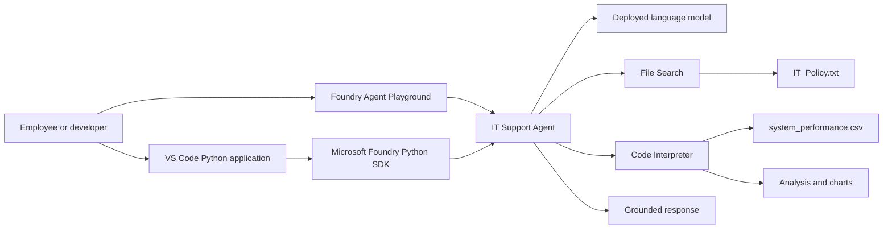

# [Build AI agents with portal and VS Code](https://gsi.learnondemand.net/Lab/81350?instructionSetLang=en&classId=770602)

## Use Case 2: Prototyping multimodal agents with Microsoft Foundry and the AI Toolkit

This lab builds an IT support agent by combining the Microsoft Foundry portal,
Foundry Toolkit for Visual Studio Code, grounding data, built-in tools, and the
Python SDK. The agent answers IT policy questions, analyzes structured system
performance data, and generates charts.

Estimated duration: **45 minutes**

> Some Microsoft Foundry features used in this exercise may be in preview or
> active development. Portal labels and extension behavior can change.

## Objectives

After completing this lab, you will have practical experience with:

- ✅ AI Agent Development
- ✅ RAG / File Search Grounding
- ✅ Code Interpreter Integration
- ✅ CSV Data Analysis
- ✅ Chart Generation
- ✅ Foundry Portal Experience
- ✅ AI Toolkit (VS Code) Experience
- ✅ Python SDK Integration
- ✅ Multimodal Inputs (Documents + Structured Data)

## Scenario

Contoso Corporation needs an AI-powered IT support agent. The agent must:

- Answer employee questions using approved IT policy documentation.
- Avoid inventing answers when the policy does not contain the information.
- Recommend contacting IT support when necessary.
- Analyze system-performance data with Python.
- Identify concerning performance trends.
- Generate charts from CSV data.
- Be accessible from both the Foundry portal and a Python application in VS Code.

## Architecture



## Prerequisites

- An Azure subscription with permission and quota to create Foundry resources.
- Visual Studio Code.
- Foundry Toolkit extension for Visual Studio Code.
- Python **3.13**. The source lab was tested with Python 3.13.12.
- Git.
- Basic familiarity with Azure AI services and Python.

> Python 3.14 is not supported by all required dependencies. Use Python 3.13
> for the closest match to the tested lab environment.

## Lab data

Download these files before configuring the agent:

- [IT_Policy.txt](https://raw.githubusercontent.com/MicrosoftLearning/mslearn-ai-agents/main/Labfiles/01-build-agent-portal-and-vscode/IT_Policy.txt)
- [system_performance.csv](https://raw.githubusercontent.com/MicrosoftLearning/mslearn-ai-agents/main/Labfiles/01-build-agent-portal-and-vscode/system_performance.csv)

`IT_Policy.txt` is used by File Search for grounded answers.
`system_performance.csv` is used by Code Interpreter for analysis and charts.

## Part 1: Create the Foundry project and agent

1. Open the [Microsoft Foundry portal](https://ai.azure.com/) and sign in.
2. Select **Start building** to use the new Foundry experience.
3. Create a project such as `it-support-agent-project`.
4. Under **Advanced options**, select the Foundry resource, Azure region,
   subscription, and resource group.
5. Create the project and wait for deployment to finish.
6. Select **Create agent**.
7. Name the agent `it-support-agent`.

## Part 2: Configure the agent

Use these agent instructions:

```text
You are an IT Support Agent for Contoso Corporation.
You help employees with technical issues and IT policy questions.

Guidelines:
- Always be professional and helpful
- Use the IT policy documentation to answer questions accurately
- If you don't know the answer, admit it and suggest contacting IT support directly
- When creating tickets, collect all necessary information before proceeding
```

Add the following tools:

1. **File Search** — upload and attach `IT_Policy.txt`.
2. **Code Interpreter** — upload `system_performance.csv`.

Wait for the policy document to finish indexing, then save the agent.

## Part 3: Validate in the Foundry playground

### Test File Search grounding

```text
What's the policy for password resets?
```

```text
How do I request new software?
```

The answers should use the IT policy document rather than unsupported general
knowledge.

### Test CSV analysis

```text
Can you analyze the system performance data and tell me if there are any concerning trends?
```

The response should invoke Code Interpreter and summarize trends found in the
CSV file.

### Test chart generation

```text
Create a chart showing CPU usage over time from the performance data.
```

The response should invoke Code Interpreter and produce a chart artifact.

## Part 4: Continue in VS Code

The programmatic stage will use Foundry Toolkit and the Python SDK to connect to
the existing project and agent. The implementation should:

1. Authenticate to Azure securely.
2. Connect to the Foundry project endpoint.
3. Reference the existing `it-support-agent`.
4. Send user prompts programmatically.
5. Display text responses, tool usage, citations, and generated files.
6. Reuse the File Search and Code Interpreter configuration created in the portal.

The supplied exercise text ends before the detailed VS Code implementation,
so the Python client and its exact package versions will be added during the
implementation stage.

## Planned project structure

```text
Use case 2 - Prototyping multimodal agents with Microsoft Foundry and the AI Toolkit/
|-- README.md
|-- requirements.txt
|-- agent_client.py
|-- .gitignore
`-- data/
    |-- IT_Policy.txt
    `-- system_performance.csv
```

## Completion criteria

- The agent answers both IT policy questions using File Search.
- The agent identifies trends in the supplied CSV data.
- The agent creates a CPU-usage chart.
- The same agent can be invoked from VS Code using Python.
- No Azure credentials, tokens, or secrets are committed to source control.
