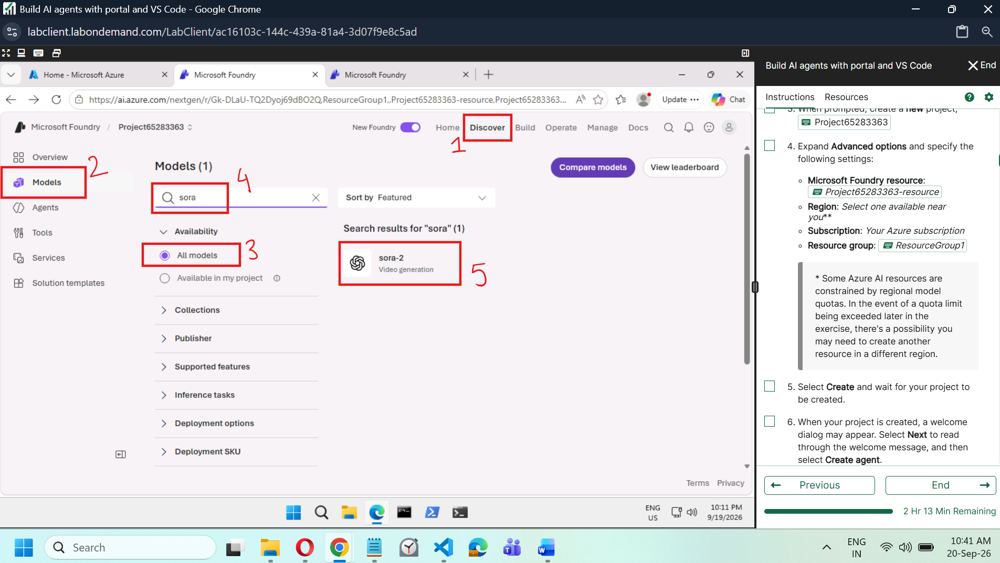
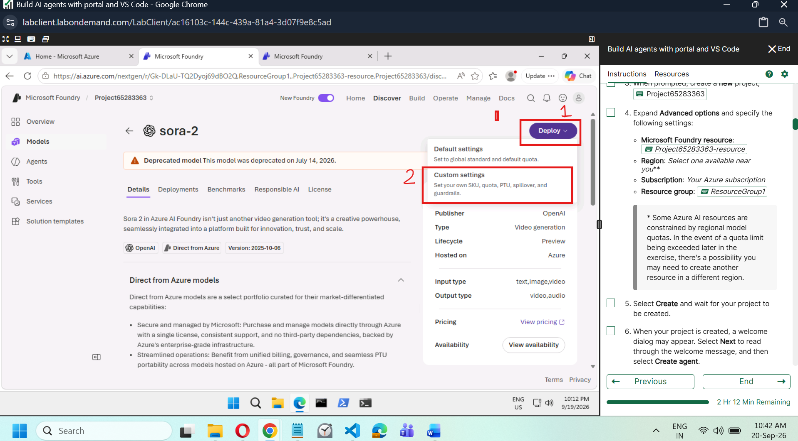
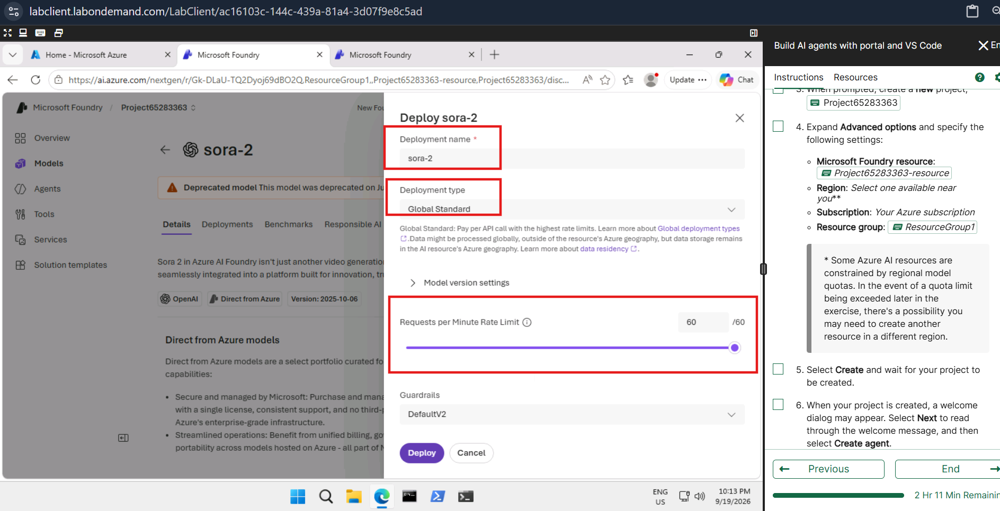
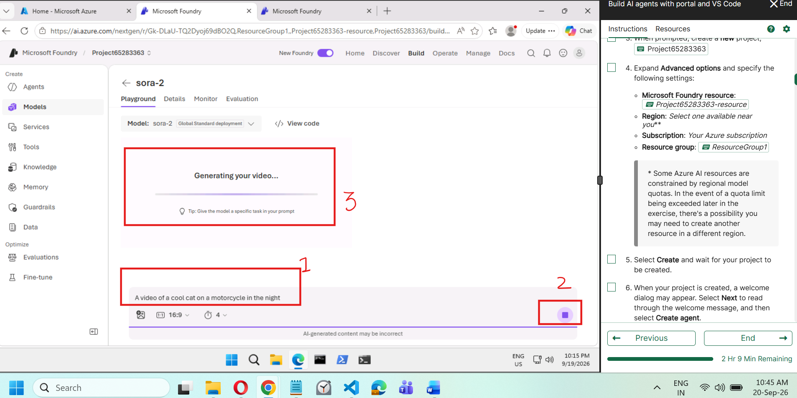
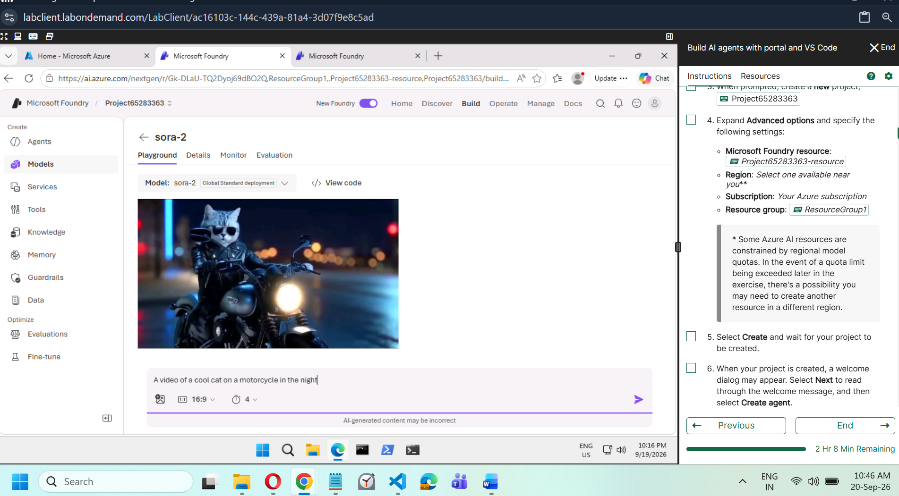

# Lab Guide: Building Video Generation Workflows with Sora in Microsoft Foundry

## Objective

In this lab, you will use the Microsoft Foundry portal to discover a video
generation model, create a Sora deployment, submit a natural-language prompt,
monitor the generation job, and review the generated video. No programmatic
implementation is required.

## Learning outcomes

After completing this lab, you will be able to:

- Find video generation models in the Microsoft Foundry model catalog.
- Review model availability and lifecycle information before deployment.
- Configure a custom model deployment.
- Generate a video from a natural-language description.
- Monitor video generation progress.
- Review a result and refine the prompt for another generation.

## Prerequisites

- An active Azure subscription.
- Access to a Microsoft Foundry project.
- Permission to deploy models in the project.
- Access to a region and quota that support the selected Sora model.
- A supported web browser.

> **Important:** Model availability, versions, quotas, and portal labels can
> change. The source screenshots show `sora-2`, version `2025-10-06`, with a
> deprecation warning dated July 14, 2026. During the lab, use the Sora/video
> generation model specified by your instructor and currently available in your
> project. Do not deploy a deprecated model in a production solution.

## Lab architecture

```text
User writes a video prompt
            |
            v
Microsoft Foundry project
            |
            v
Deployed Sora video generation model
            |
            v
Video generation playground
            |
            v
Asynchronous generation job and progress indicator
            |
            v
Generated video -> Review -> Refine prompt -> Generate again
```

## Step 1: Open the lab and Microsoft Foundry project

1. Launch the **Build AI agents with portal and VS Code** lab from the lab
   portal, if this environment is being used.
2. Sign in to [Microsoft Foundry](https://ai.azure.com).
3. Open the project supplied by the lab or select your own project.
4. Confirm that the project has a supported region and sufficient model quota.

## Step 2: Discover the Sora model

1. Select **Discover** on the top navigation bar.
2. Select **Models** in the left navigation.
3. Under **Availability**, select **All models**.
4. Enter `sora` in the search box.
5. Select the available Sora video generation model, shown as `sora-2` in the
   source screenshot.



**What the screenshot shows:** The Microsoft Foundry **Discover** area is open.
**Models** is selected, the catalog is filtered to **All models**, and the search
term `sora` returns the `sora-2` video generation model. The numbered red boxes
show the selection order: Discover, Models, All models, search, and model result.
The panel on the right belongs to the hosted lab environment, not to Foundry.

## Step 3: Review the model and open custom deployment settings

1. Review the model's **Details**, publisher, version, lifecycle, input/output
   types, pricing, and availability.
2. Read any lifecycle or deprecation warning before continuing.
3. Select **Deploy**.
4. Select **Custom settings**.

Use custom settings when you need to control the deployment name, deployment
type, request-rate limit, model version behavior, and guardrails.



**What the screenshot shows:** The `sora-2` model details page displays its
publisher, video-generation type, preview lifecycle, supported input and output
types, and availability link. The **Deploy** menu is expanded and **Custom
settings** is highlighted. The orange banner also warns that this captured model
version was deprecated on July 14, 2026; this warning must be checked before a
deployment is created.

## Step 4: Configure and deploy the model

1. Enter a recognizable **Deployment name**, such as `sora-2`.
2. Select a supported **Deployment type**. The screenshot uses **Global
   Standard**.
3. Expand **Model version settings** and confirm the version behavior required
   for the lab.
4. Set the **Requests per Minute Rate Limit** within the quota available to your
   project. The screenshot shows `60` only as an example; your maximum may be
   different.
5. Select the required **Guardrails** configuration. The screenshot shows
   `DefaultV2`.
6. Select **Deploy** and wait until deployment completes.



**What the screenshot shows:** The **Deploy sora-2** dialog highlights the
deployment name, the **Global Standard** deployment type, and the request-rate
limit. It also exposes model-version settings and a guardrails selector. The
purple **Deploy** button submits the configuration.

> **Troubleshooting:** If deployment fails because the model, region, or quota is
> unavailable, use the region/model assigned by the instructor or create a
> supported project as directed by the lab. Do not arbitrarily increase the rate
> limit beyond the available quota.

## Step 5: Open the video generation playground

1. After deployment, open **Build** > **Models**.
2. Select the deployed Sora model.
3. Open the **Playground** tab.
4. Confirm that the model selector shows the deployment created in Step 4.

## Step 6: Enter a video prompt and settings

1. In the prompt area, enter a precise description of the video. The source
   example is:

   ```text
   A video of a cool cat on a motorcycle in the night.
   ```

2. If available, configure the required aspect ratio and duration. The source
   screenshot shows a `16:9` aspect ratio and a duration of `4` seconds.
3. Optionally add a supported reference image when the lab scenario requires
   image-guided generation.
4. Select the purple **Generate** arrow.

For a better result, describe the subject, action, environment, camera movement,
lighting, visual style, and desired mood. Avoid entering personal, confidential,
or copyrighted source material unless its use is authorized.

## Step 7: Monitor generation progress

Wait while Foundry displays **Generating your video...**. Video generation is an
asynchronous operation and can take longer than a normal chat response. Do not
submit the same prompt repeatedly while the current job is still running.



**What the screenshot shows:** The Sora deployment is open on the **Playground**
tab. The prompt appears at the bottom, the generation control changes to a stop
button, and the main output area shows a progress bar with **Generating your
video...**. The highlighted areas identify the prompt, active job control, and
processing status. The model selector confirms a `sora-2` Global Standard
deployment.

Conceptually, the service interprets the prompt and produces a sequence of
visually consistent frames, then composes them into the requested video. The
portal exposes job progress, not each internal model-processing stage.

## Step 8: Review the generated video

1. When processing finishes, play the generated video.
2. Compare the result with the requested subject, action, environment, camera,
   lighting, style, aspect ratio, and duration.
3. Check for visual artifacts, inconsistent motion, incorrect objects, or unsafe
   content.
4. If the result does not meet the objective, revise the prompt and generate a
   new version.



**What the screenshot shows:** The completed result is displayed above the
prompt. It depicts a cat wearing sunglasses and riding a motorcycle at night,
which matches the central subject and setting requested in the prompt. The prompt
and generation settings remain visible, allowing the user to adjust them and run
another iteration.

## Step 9: Try additional business prompts

### Smart city

```text
A futuristic smart city at sunrise with flying electric vehicles, glass towers,
green rooftops, and pedestrians using public transit; slow aerial camera movement,
realistic lighting, cinematic style.
```

### Healthcare

```text
Doctors reviewing holographic patient records in a futuristic hospital, smooth
camera movement, realistic lighting, cinematic documentary style.
```

### Manufacturing

```text
A modern factory using AI-powered robots to assemble electric cars, workers
collaborating with digital dashboards, cinematic industrial film style.
```

Generate one prompt at a time. Review the result and change only one or two prompt
elements between runs so that you can identify which wording improved the video.

## Validation checklist

- [ ] The Sora/video generation model was found in the model catalog.
- [ ] Model availability and lifecycle status were reviewed.
- [ ] The model was deployed with valid settings and guardrails.
- [ ] The deployment opened in the video generation playground.
- [ ] A natural-language prompt was submitted.
- [ ] Generation progress was observed.
- [ ] The completed video was reviewed against the prompt.
- [ ] At least one refinement or additional business prompt was tested.

## Expected outcome

You have completed an end-to-end portal workflow for generative video: model
discovery, controlled deployment, prompt-based generation, progress monitoring,
output review, and iterative prompt refinement.
